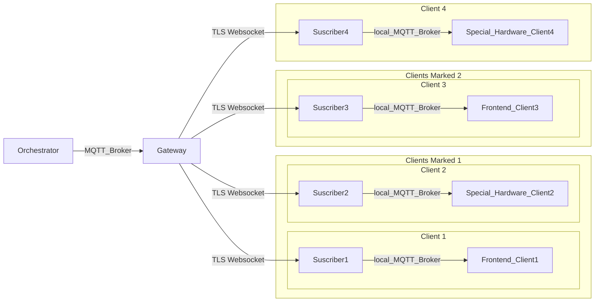

# System Architecture Document (SAD)

## 1. Introduction

### Project Objective:
The objective of this project is to develop a foundational prototype of a centralized control system for mobile devices in order to use them as light infrastructure for enhancing live events.

### Purpose of the document
This document serves two main purposes:

- **Host the Lamarr Project Architectural decisions**: It provides a detailed overview of the proposed architecture and the reason for these design decisions of the Lamarr project prototype. This information is intended to be used for future reference and development of the project.
- **Provide Technical Explanations**: The document also includes technical explanations of the design decisions and limitations of the proposed architecture. This information is aimed at facilitating a better understanding of the project's architecture among stakeholders and developers.

## 2. System Overview

The current proposed architecture for Lamarrs is based on specific actors with clear functions and reponsibilities.
The best summarized graph explaining the basic architecture can be found next.

## 3. Architectural Goals and Constraints

### Goals
The main goal of the current design focus on blazing fast communication with the clients and keeping latency at its lowest. Meanwhile, from the design standpoint, the idea is minimize coupling, maximizing scalability and compatibility.
For the MVP the target is to be able to handle around 30 devices at the same time, being able to change certain parameters, like color or making them produce a sound.
Deployment and software size is also important, as this app must be as lightweight as possible to minimize the energy requirements and keep it as an atractive solution for shows in open spaces without the need of access to big batteries or electrical grid.

### Constraints
One of the main budget limitations comes from having a single developer currently. (This might leak also into the maintainance of this documentation up to date too).
Tech wise, there are no big limitations, save for the need of using a compiled language that can create very small binaries. Rust was selected for this main reason. As is known, Rust is a language with a steep learning curve, and this might affect some of the solutions too.
A big constraint on the future design of the clients could come from GPDR, as keeping data that might be used for tracking devices -even if the data is saved for the lenght of the show- requires approval and concent from the user.

## 4. Architectural Views
### 4.1. Functional
#### 4.1.1. **Device Synchronization:**
   - The system should synchronize mobile devices to ensure coordinated actions during events.
   
#### 4.1.2. **Text Broadcasting Control:**
   - The system must be able to broadcast text to the mobile devices remotely.
   
#### 4.1.3. **Audiovisual Enhancements:**
   - The system should support audiovisual enhancements, such as synchronized music playing via the devices' speakers with visual effects on mobile devices.
   
#### 4.1.4 **No Interactivity:**
   - Mobile devices should not be interactive, as this is a tool for supporting the event, not to generate distractions.
   

### 4.2. Structural
TODO as is currently undefined:
- Components and their relationships
- Data flows and interfaces between components

### 4.3. Deployment
TODO as is currently undefined:
- Hardware infrastructure and deployment topology
- Distribution of system components across servers or devices

### 4.4. Behavioral
TODO as is currently undefined:
- Sequence diagrams or activity diagrams illustrating system behavior
- States and state transitions of system components
- Event-driven architecture or messaging patterns

## 5. Quality Attributes
### 5.1 Non functional
#### 5.1.1. **Performance:**
    - The system should have low latency and high responsiveness to ensure and maintain synchronicity with and between the mobile devices.
   
#### 5.1.2. **Portability:**
   - It is required for the server to have an extremely tiny footprint, while having an extreme flexibility to be ported to several different hardware architectures.
   
#### 5.1.3. **Scalability:**
   - The infrastructure should be scalable to accommodate a numerous mobile devices and users simultaneously.
   
#### 5.1.4. **Reliability:**
   - The system should be reliable, with minimal downtime or disruptions during events. Ideally, must have some level of self-healing.

### 5.2 Non functional desirable:

#### 5.2.5. **Usability:**
   - The user interface of the control system should be intuitive and easy to use, catering to both event organizers and attendees.

#### 5.2.6. **Security:**
   - Data transmission and communication between mobile devices and the centralized control system should be encrypted and secure to prevent unauthorized access or tampering.
   

## 6. Technology Stack

The goal completion for the Lamarrs project depends heavily on being a low latency, small footprint solution. Rust is a system level programming language, with a very strong memory safe ownership model -which makes refactoring an easier and more confidency inspiring taks-, with an equivalent performance as C/C++ and with a considerably comfortable code style than other low level languages.
Lamarrs opted to employ Rust based on its considerably fast performance and minimal package size.

TODO as is currently undefined for the frontend:
- Technologies and frameworks used in the system
- Justification for technology choices
- Dependencies and compatibility considerations