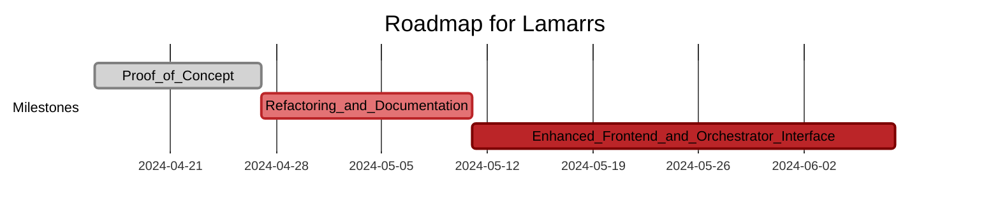

# Roadmap for Lamarrs Project

## Milestone 1: Proof of Concept (PoC)
- **Objective:** Establish core functionality of the Lamarrs project, allowing communication between server and clients.
  
- **Tasks:**
  1. Set up a web server capable of handling client connections and message communication.
  2. Implement client-side functionality to connect to the server, send messages, and receive messages from the server.
  3. Develop basic error handling mechanisms to handle server and client errors gracefully.
  4. Enable clients to write messages to the server.

- **Deliverables:**
  - Functional web server pushing messages to clients.
  - Basic client functionality to send and receive messages.
  - Initial PoC demonstrating communication between server and clients.

## Milestone 2: Refactoring and Documentation
- **Objective:** Improve the PoC by refactoring code for better error management, adding tests, and providing documentation.
  
- **Tasks:**
  1. Refactor codebase to enhance error management and code quality.
  2. Implement unit and integration tests to ensure reliability.
  3. Document codebase, including API documentation and architectural diagrams.
  4. Create external interfaces/API for interacting with the server and clients.
  5. Develop a mechanism to discriminate clients based on various parameters.
  6. Implement a basic UI attached to the client API for user interaction.

- **Deliverables:**
  - Refactored codebase with improved error handling.
  - Comprehensive documentation including API specifications and architectural diagrams.
  - External interfaces/APIs for server and client interactions.
  - Mechanism to discriminate clients.
  - Basic UI integrated with client API.

## Milestone 3: Enhanced Front-end and Orchestrator Interface
- **Objective:** Design a more robust front-end and implement an orchestrator interface to sync messages to the server.
  
- **Tasks:**
  1. Design and develop a more polished front-end capable of receiving messages from the client API and adjusting behavior accordingly.
  2. Enhance client API to support dynamic changes in UI behavior based on server messages.
  3. Implement an orchestrator interface responsible for synchronizing messages between clients and the server.
  
- **Deliverables:**
  - Improved front-end with dynamic behavior based on server messages.
  - Fully functional orchestrator interface for message synchronization.
  - Integration of orchestrator interface with server and client components.

### Additional Considerations:
- **Feedback and Iteration:** Gather feedback from users during each milestone and iterate based on their suggestions and requirements.

## Timeline:

